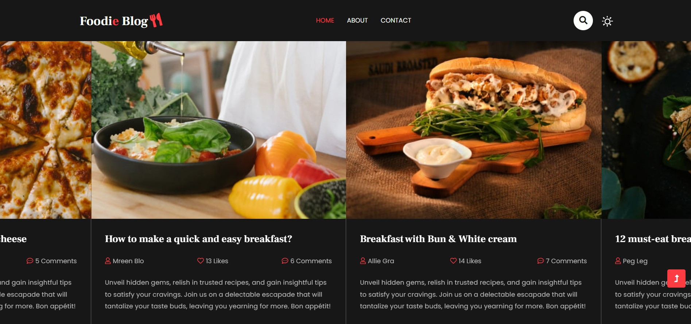
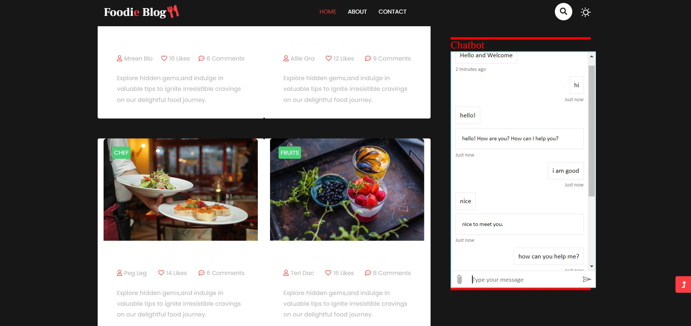
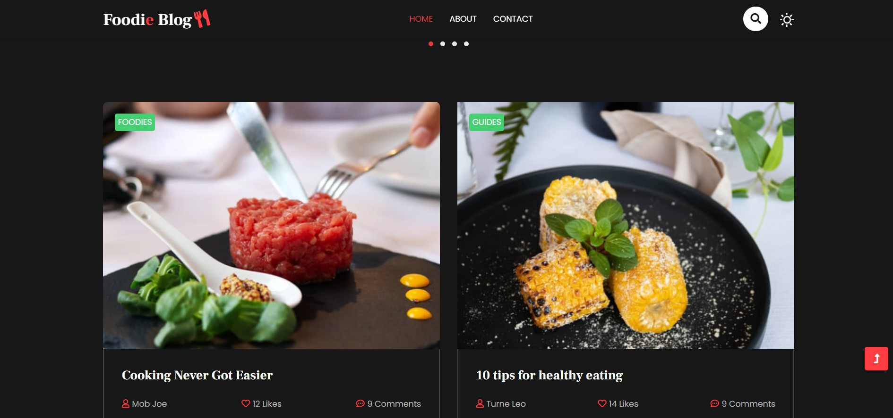
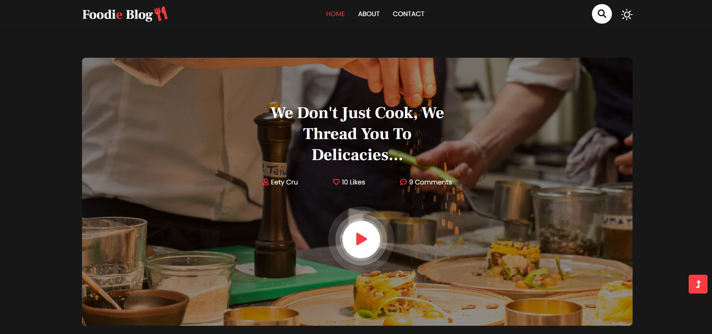
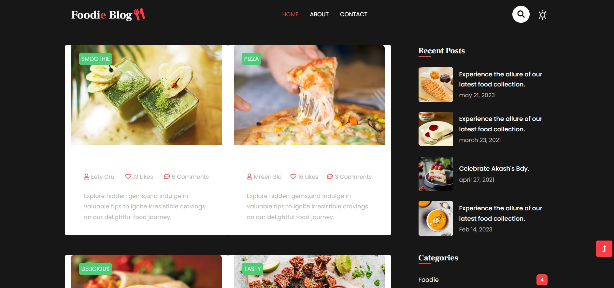
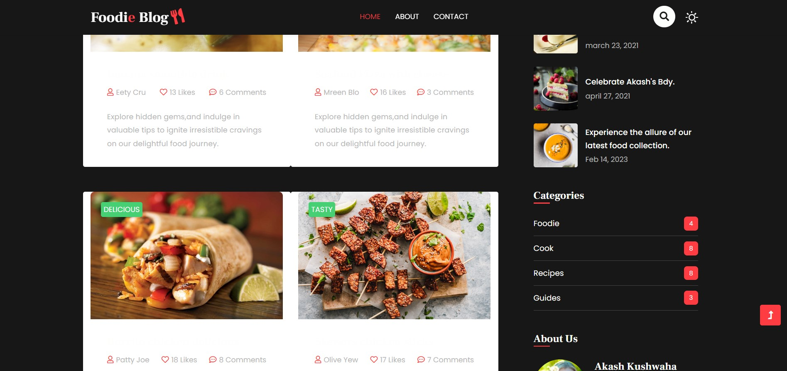
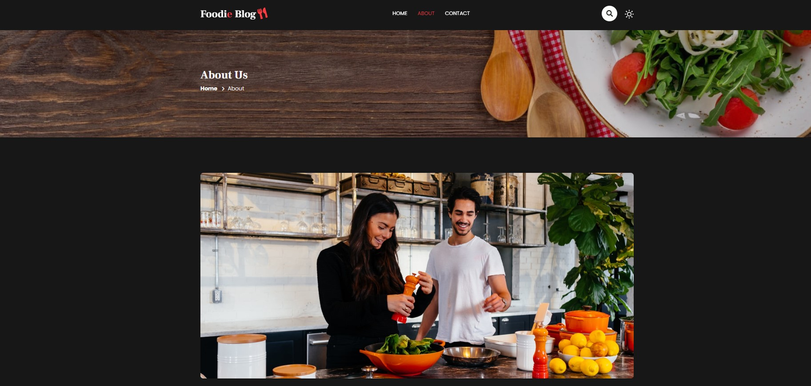
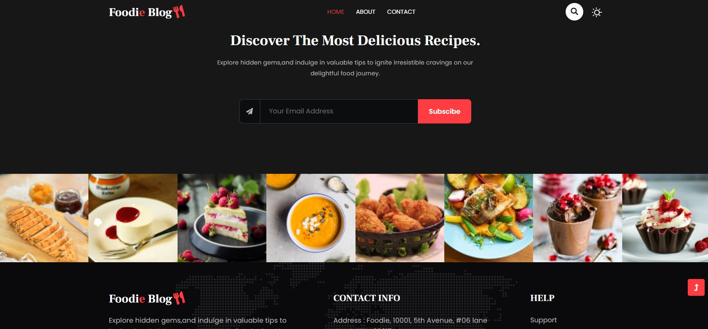
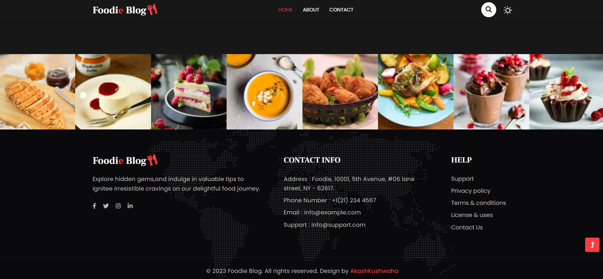
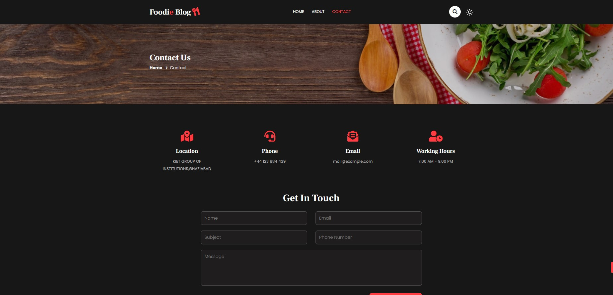

# FTR_Internship_Project
This is my Final Project for Microsoft Future Ready Talent Internship.
 
I used Microsoft Azure Static <h1>Web Service</h1>, backend Storage, and Azure Chatbot Service for this project.
 
It is my deployed project (link for ms azure)
 
#Azure link https://proud-pebble-03fe1a510.3.azurestaticapps.net/

 

 

 

 

 

 

 

 

 

